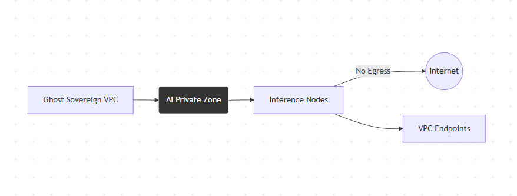
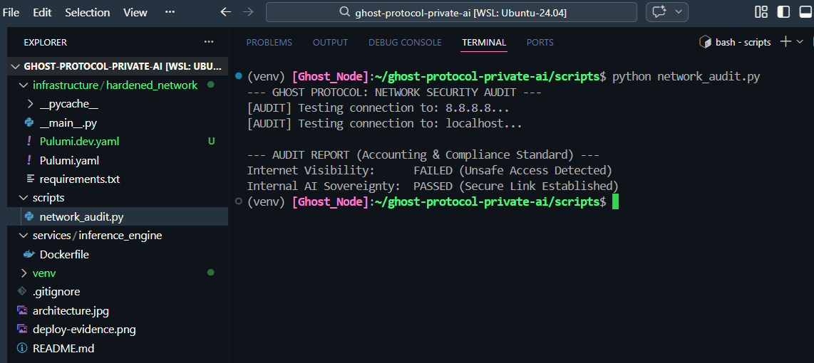

# 🛡️ Ghost Protocol: Private AI Sanctuary

**Sovereign AI infrastructure engineered to bridge the gap between Accounting and high-performance computing.**

Implementation of **Zero-Trust Networking** where no AI inference nodes have public IP mappings, ensuring absolute internal sovereignty.

**Fiscal Efficiency:** Architecture designed to eliminate unnecessary NAT Gateway costs in development environments by leveraging VPC Endpoints for secure communication with AWS services.

---

### 🏛️ Governance & Methodology

This project follows the **Hardened by Design™** framework, ensuring that AI workloads remain sovereign and cost-effective. By leveraging my background in **Accounting**, I've implemented:

* **Audit-Ready Infrastructure:** Every component is designed to be verifiable via automated scripts (see `scripts/network_audit.py`).
* **Zero-Waste Networking:** Minimalist network design to reduce AWS egress costs and NAT Gateway overhead.
* **Asynchronous Excellence:** Designed for high-performance, autonomous environments where documentation is the single source of truth.

---

### 🛠️ Tech Stack & DevSecOps Standards
* **IaC:** Pulumi (Python)
* **Cloud:** AWS (VPC, Subnets, IAM)
* **Security:** Zero-Trust Egress Control
* **Governance:** Automated Network Auditing

---

## 🚀 Infrastructure Validation

### 1. Deployment Evidence
Below is the successful stack trace of the **Ghost Protocol** infrastructure being provisioned in 24 seconds.

### 2. Security & Compliance Audit
Running the automated audit suite to verify Zero-Trust compliance.
